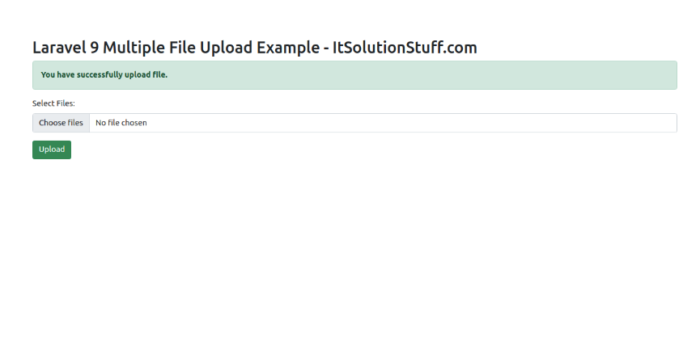

# Laravel9_multiple_file
## 1. Install Laravel 9
```Dockerfile
composer create-project laravel/laravel laravel9_multiple_file
```
## 2. Create Migration and Model
```Dockerfile
php artisan make:migration create_files_table
```
- Vào database/migrations/2022_02_10_140040_create_images_table.php
```Dockerfile
<?php
  
use Illuminate\Database\Migrations\Migration;
use Illuminate\Database\Schema\Blueprint;
use Illuminate\Support\Facades\Schema;
  
return new class extends Migration
{
    /**
     * Run the migrations.
     *
     * @return void
     */
    public function up()
    {
        Schema::create('files', function (Blueprint $table) {
            $table->id();
            $table->string('name');
            $table->timestamps();
        });
    }
  
    /**
     * Reverse the migrations.
     *
     * @return void
     */
    public function down()
    {
        Schema::dropIfExists('files');
    }
};
```
- Chạy lệnh tạo bảng và model:
```Dockerfile
php artisan migrate
```
```Dockerfile
php artisan make:model File
```
- Vào app/Models/File.php
```Dockerfile
<?php
  
namespace App\Models;
  
use Illuminate\Database\Eloquent\Factories\HasFactory;
use Illuminate\Database\Eloquent\Model;
  
class File extends Model
{
    use HasFactory;
  
    protected $fillable = [
        'name'
    ];
}
```
## 3. Create Controller
```Dockerfile
php artisan make:controller FileController
```
- Vào file controlle app/Http/Controllers/FileController.php
```Dockerfile
<?php
  
namespace App\Http\Controllers;
  
use Illuminate\Http\Request;
use App\Models\File;
  
class FileController extends Controller
{
    /**
     * Display a listing of the resource.
     *
     * @return \Illuminate\Http\Response
     */
    public function index()
    {
        return view('fileUpload');
    }
    
    /**
     * Display a listing of the resource.
     *
     * @return \Illuminate\Http\Response
     */
    public function store(Request $request)
    {
        $request->validate([
            'files' => 'required',
            'files.*' => 'required|mimes:pdf,xlx,csv|max:2048',
        ]);
      
        $files = [];
        if ($request->file('files')){
            foreach($request->file('files') as $key => $file)
            {
                $fileName = time().rand(1,99).'.'.$file->extension();  
                $file->move(public_path('uploads'), $fileName);
                $files[]['name'] = $fileName;
            }
        }
  
        foreach ($files as $key => $file) {
            File::create($file);
        }
     
        return back()
                ->with('success','You have successfully upload file.');
   
    }
}
```
Lưu trữ hình ảnh trong thư mục lưu trữ(Storage Folder)
```Dockerfile
$file->storeAs('files', $fileName);
// storage/app/files/file.png
```
Lưu trữ Hình ảnh trong Thư mục Public
```Dockerfile
$file->move(public_path('files'), $fileName);
// public/files/file.png
```
Lưu trữ hình ảnh trong S3
```Dockerfile
$file->storeAs('files', $fileName, 's3');
```
## 4.Create and Add Routes
- Vào routes/web.php
```Dockerfile
<?php
  
use Illuminate\Support\Facades\Route;
  
use App\Http\Controllers\FileController;
  
/* 
|--------------------------------------------------------------------------
| Web Routes
|--------------------------------------------------------------------------
|
| Here is where you can register web routes for your application. These
| routes are loaded by the RouteServiceProvider within a group which
| contains the "web" middleware group. Now create something great!
|
*/
  
Route::controller(FileController::class)->group(function(){
    Route::get('file-upload', 'index');
    Route::post('file-upload', 'store')->name('file.store');
});
```
## 5.Create Blade File
- Vào resources/views/fileUpload.blade.php
```Dockerfile
<!DOCTYPE html>
<html>
<head>
    <title>Laravel 9 Multiple File Upload Example - ItSolutionStuff.com</title>
    <link href="https://cdn.jsdelivr.net/npm/bootstrap@5.0.2/dist/css/bootstrap.min.css" rel="stylesheet">
</head>
      
<body>
<div class="container">
       
    <div class="panel panel-primary">
  
      <div class="panel-heading">
        <h2>Laravel 9 Multiple File Upload Example - ItSolutionStuff.com</h2>
      </div>
  
      <div class="panel-body">
       
        @if ($message = Session::get('success'))
            <div class="alert alert-success alert-block">
                <strong>{{ $message }}</strong>
            </div>
        @endif
      
        <form action="{{ route('file.store') }}" method="POST" enctype="multipart/form-data">
            @csrf
  
            <div class="mb-3">
                <label class="form-label" for="inputFile">Select Files:</label>
                <input 
                    type="file" 
                    name="files[]" 
                    id="inputFile"
                    multiple 
                    class="form-control @error('files') is-invalid @enderror">
  
                @error('files')
                    <span class="text-danger">{{ $message }}</span>
                @enderror
            </div>
   
            <div class="mb-3">
                <button type="submit" class="btn btn-success">Upload</button>
            </div>
       
        </form>
      
      </div>
    </div>
</div>
</body>
    
</html>
```
## 6. Chạy project

```Dockerfile
php artisan serve
```
-  Vào 
http://localhost:8000/file-upload


